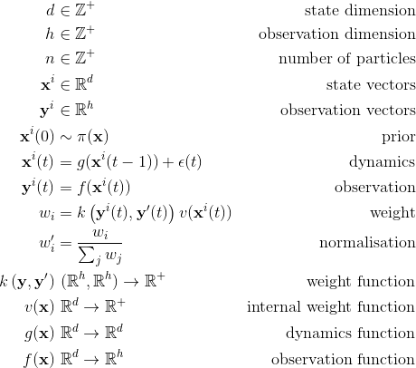

# pfilter
Basic Python particle filter. Plain SIR filtering, with various resampling algorithms. Written to be simple and clear; not necessarily most efficient or most flexible implementation. Depends on [NumPy](http://numpy.org) only. 

## Uses

This repo is useful for understanding how a particle filter works, or a quick way to develop a custom filter of your own from a relatively simple codebase. 
### Alternatives
There are more mature and sophisticated packages for probabilistic filtering in Python (especially for Kalman filtering) if you want an off-the-shelf solution:

#### Particle filtering
* [particles](https://github.com/nchopin/particles) Extensive particle filtering, including smoothing and quasi-SMC algorithms
* [FilterPy](https://github.com/rlabbe/filterpy) Provides extensive Kalman filtering and basic particle filtering.
* [pyfilter](https://github.com/tingiskhan/pyfilter) provides Unscented Kalman Filtering, Sequential Importance Resampling and Auxiliary Particle Filter models, and has a number of advanced algorithms implemented, with PyTorch backend.

#### Kalman filtering
* [pykalman](https://github.com/pykalman/pykalman) Easy to use Kalman Filter, Extended Kalman Filter and Unscented Kalman Filter implementations
* [simdkalman](https://github.com/oseiskar/simdkalman) Fast implmentations of plain Kalman filter banks.
* [torch-kalman](https://github.com/strongio/torch-kalman) PyTorch implementation of Kalman filters, including Pandas dataframe support.


## Installation

Available via PyPI:

    pip install pfilter
    
Or install the git version:

    pip install git+https://github.com/johnhw/pfilter.git

## Usage
Create a `ParticleFilter` object, then call `update(observation)` with an observation array to update the state of the particle filter.

Calling `update()` without an observation will update the model without any data, i.e. perform a prediction step only.

### Model

* Internal state space of `d` dimensions
* Observation space of `h` dimensions
* `n` particles estimating state in each time step

Particles are represented as an `(n,d)` matrix of states, one state per row. Observations are generated from this matrix into an `(n,h)` matrix of hypothesized observations via the observation function.

### Functions 
You need to specify at the minimum:

* an **observation function** `observe_fn(state (n,d)) => observation matrix (n,h)` which will return a predicted observation for an internal state.
* a function that samples from an **initial distributions** `prior_fn => state matrix (n,d)` for all of the internal state variables. These are usually distributions from `scipy.stats`. The utility function `independent_sample` makes it easy to concatenate sampling functions to sample the whole state vector.
* a **weight function** `weight_fn(hyp_observed (n,h), real_observed (h,)) => weight vector (n,)` which specifies how well each of the `hyp_observed` arrays match the real observation `real_observed`. This must produce a strictly positive weight value for each hypothesized observation, where larger means more similar. This is often an RBF kernel or similar.


---

Typically, you would also specify:
*  **dynamics** a function `dynamics_fn(state (n,d)) => predicted_state (n,d)` to update the state based on internal (forward prediction) dynamics, and a 
* **diffusion** a function `noise_fn(predicted_state (n,d)) => noisy_state (n,d)` to add diffusion into the sampling process (though you could also merge into the dynamics). 

---

You might also specify:

* **Internal weighting** a function `internal_weight_fn(state (n,d)) => weight vector (n,)` which provides a weighting to apply on top of the weight function based on *internal* state. This is useful to impose penalties or to include learned inverse models in the inference.
* **Post-processing transform function** a function `transform_fn(state (n,d), weights (n,)) => states(n, k)` which can apply a post-processing transform and store the result in `transformed_particles`

#### Missing observations
If you want to be able to deal with partial missing values in the observations, the weight function should support masked arrays. The `squared_error(a,b)` function in `pfilter.py` does this, for example.

### Passing values to functions

Sometimes it is useful to pass inputs to callback functions like `dynamics_fn(x)` at each time step. You can do this by giving keyword arguments to `update()`. 

If you call `pf.update(y, t=5)` **all** of the functions `dynamics_fn, weight_fn, noise_fn, internal_weight_fn, observe_fn` will receive the keyword argument `t=5`. ALl `kwargs` are forwarded to these calls. You can just ignore them if not used (e.g. define `dynamics_fn = lambda x, **kwargs: real_dynamics(x)`) but this can be useful for propagating inputs that are neither internal states nor observed states to the filter. If no `kwargs` are given to `update`, then no extra arguments are passed to any of callbacks.

## Attributes

The `ParticleFilter` object will have the following useful attributes after updating:

* `original_particles` the `(n,d)` collection of particles in the last update step
* `mean_state` the `(d,)` expectation of the state
* `mean_hypothesized`  the `(h,)` expectation of the hypothesized observations
* `cov_state` the `(d,d)` covariance matrix of the state
* `map_state` the `(d,)` most likely state
* `map_hypothesized` the `(h,)`  most likely hypothesized observation
* `weights` the  `(n,)` normalised weights of each particle

## In equations




### Example

For example, assuming we observe 32x32 images and want to track a moving circle. Assume the internal state we are estimating is the 4D vector (x, y, dx, dy), with 200 particles

```python
        from pfilter import ParticleFilter, gaussian_noise, squared_error, independent_sample
        columns = ["x", "y", "radius", "dx", "dy"]
        from scipy.stats import norm, gamma, uniform 
        
        # prior sampling function for each variable
        # (assumes x and y are coordinates in the range 0-32)    
        prior_fn = independent_sample([uniform(loc=0, scale=32).rvs, 
                    uniform(loc=0, scale=32).rvs, 
                    gamma(a=2,loc=0,scale=10).rvs,
                    norm(loc=0, scale=0.5).rvs,
                    norm(loc=0, scale=0.5).rvs])
                                    
        # very simple linear dynamics: x += dx
        def velocity(x):
            xp = np.array(x)
            xp[0:2] += xp[3:5]        
        return xp
        
        # create the filter
        pf = pfilter.ParticleFilter(
                        prior_fn=prior_fn, 
                        observe_fn=blob,
                        n_particles=200,
                        dynamics_fn=velocity,
                        noise_fn=lambda x: 
                                    gaussian_noise(x, sigmas=[0.2, 0.2, 0.1, 0.05, 0.05]),
                        weight_fn=lambda x,y:squared_error(x, y, sigma=2),
                        resample_proportion=0.1,
                        column_names = columns)
                        
        # assuming image of the same dimensions/type as blob will produce
        pf.update(image) 
 ```


* `blob` (200, 4) -> (200, 1024) which draws a blob on an image of size 32x32 (1024 pixels) for each internal state, our observation function
* `velocity` (200, 4) -> (200, 4), our dynamics function, which just applies a single Euler step integrating the velocity
* `prior_fn` which generates a (200,4) initial random state
* `gaussian_noise` (200, 4) -> (200,4) which adds noise to the internal state
* `squared_error` ((200,1024), (1024,)) -> (200,) the similarity measurement


See the notebook [examples/example_filter.py](examples/test_filter.py) for a working example using `skimage` and `OpenCV` which tracks a moving white circle.

    
    


---
<!--
\begin{align*} 
d & \in \mathbb{Z}^+ & \text{state dimension} \\
h & \in \mathbb{Z}^+& \text{observation dimension} \\
n & \in \mathbb{Z}^+& \text{number of particles} \\
{\bf x}^i &\in \mathbb{R}^d  & \text{state vectors}\\
{\bf y}^i &\in \mathbb{R}^h & \text{observation vectors}\\

{\bf x}^{i}(0) & \sim \pi({\bf x}) & \text{prior}\\
{\bf x}^i(t) & = g({\bf x}^i(t-1)) + \epsilon(t) & \text{dynamics}\\
{\bf y}^i(t) & = f({\bf x}^i(t))\ & \text{observation}\\

w_i & = k\left({\bf y}^{i}(t), {\bf y}'(t)\right)v({\bf x}^{i}(t)) & \text{weight}\\
w'_i & = \frac{w_i}{\sum_j w_j} & \text{normalisation}\\

k\left({\bf y}, {\bf y'}\right) & \  (\mathbb{R}^h, \mathbb{R}^h) \rightarrow \mathbb{R^+} & \text{weight function}
\\ 
v({\bf x}) &\  \mathbb{R}^d\rightarrow\mathbb{R}^+ & \text{internal weight function}\\
g(\bf{x}) & \ \mathbb{R}^d \rightarrow  \mathbb{R}^d & \text{dynamics function} \\
f(\bf{x}) & \ \mathbb{R}^d \rightarrow  \mathbb{R}^h & \text{observation function} \\
\end{align*}
-->
